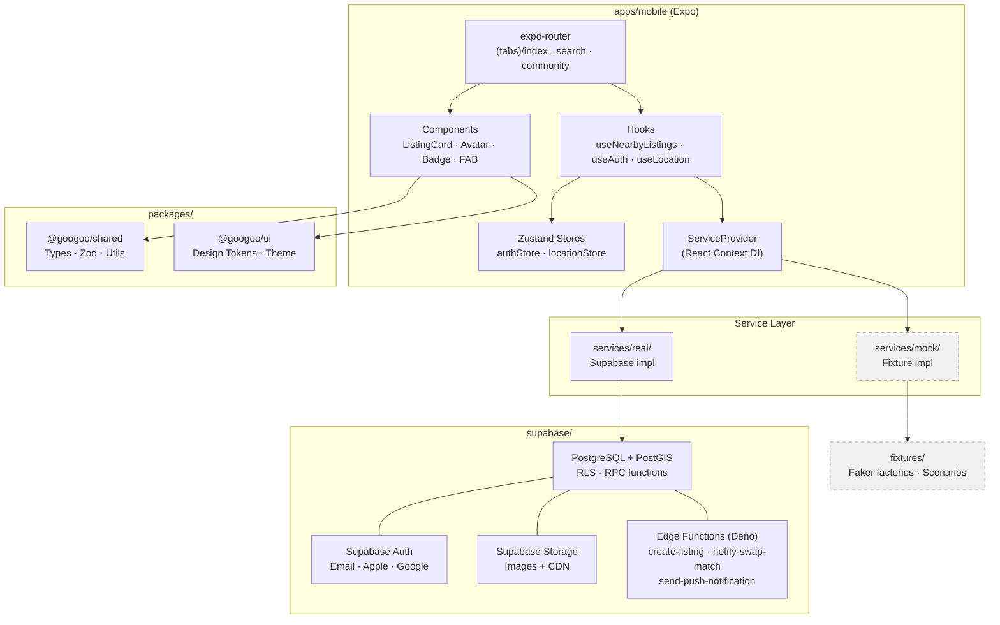
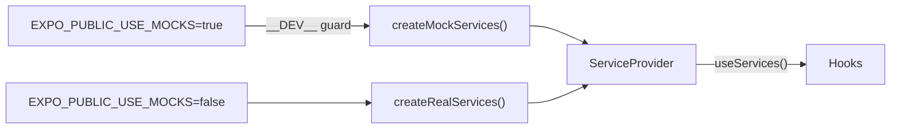
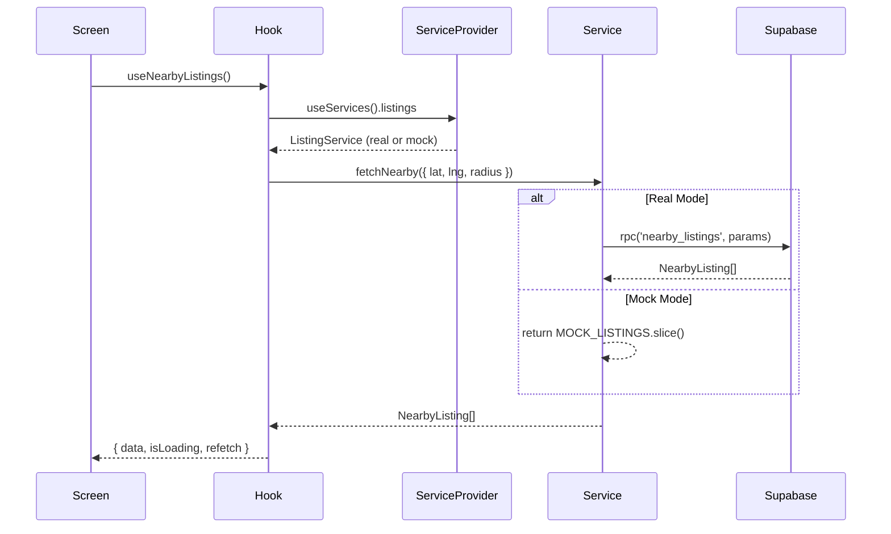

# GooGoo

GooGoo is a mobile-first marketplace where parents buy, sell, and swap children's items — and find community while doing it. Kids outgrow things fast; parents accumulate gear they no longer need and need gear they can't justify buying new. GooGoo closes that loop with a hyper-local-first approach: proximity-sorted listings, direct messaging between parents, swap matching, and neighborhood parent groups. The social layer is the moat — parents want to transact with *other parents*, not strangers on Craigslist.

---

## Quick Start

**Prerequisites:** Node 20+, [pnpm](https://pnpm.io/installation), [just](https://github.com/casey/just#installation)

```bash
git clone <repo> && cd googoo
pnpm install
just preview          # starts Expo web with mock data — no backend needed
```

Open [http://localhost:8081](http://localhost:8081). You'll see:
- **Home** — 20 listing cards with images, prices, distances, seller avatars
- **Search** — category grid (Clothing, Gear, Toys, etc.)
- **Community** — local and interest-based parent groups

### Other Commands

```bash
just --list           # show all available commands
just check            # lint + typecheck across all workspaces
just build            # full build (all packages)
just mobile::dev      # start Expo dev server (real mode)
just db::start        # start local Supabase (requires Docker)
just db::reset        # apply migrations + seed data
```

### Environment

Copy `.env.example` to `.env` and fill in your Supabase credentials for real mode. For mock/preview mode, no `.env` is needed — `just preview` sets `EXPO_PUBLIC_USE_MOCKS=true` automatically.

---

## Architecture



### Service Layer (Real vs Mock)

The app uses a **context-based dependency injection** pattern. `ServiceProvider` reads `EXPO_PUBLIC_USE_MOCKS` and provides either real (Supabase) or mock (fixture-backed) service implementations. Components and hooks are completely unaware of which mode is active.



Mock mode also pre-seeds Zustand stores (auth session, Tacoma WA location) so the app is immediately usable without permissions or sign-in.

### Data Flow



---

## Monorepo Structure

```
googoo/
├── apps/mobile/          # Expo app (iOS, Android, Web)
│   ├── app/              # expo-router file-based routes
│   ├── components/       # UI components
│   ├── hooks/            # React Query + Zustand hooks
│   ├── services/         # Service interfaces, real/, mock/
│   ├── fixtures/         # Faker factories + scenario data (dev only)
│   ├── stores/           # Zustand state
│   └── constants/        # Categories, config
├── packages/shared/      # @googoo/shared — Types, Zod schemas, utils
├── packages/ui/          # @googoo/ui — Design tokens, theme (tsup build)
├── config/               # Shared ESLint, TypeScript, Prettier configs
├── supabase/             # Migrations, Edge Functions, seed data
├── justfile              # Task runner (just preview, just check, etc.)
└── turbo.json            # Turborepo build orchestration
```

---

## Tech Stack

| Layer | Choice |
|-------|--------|
| Framework | Expo SDK 52+ (React Native) — iOS, Android, Web |
| Routing | expo-router v4 (file-based) |
| Backend | Supabase (PostgreSQL + PostGIS + Auth + Realtime + Storage) |
| Client State | Zustand |
| Server State | @tanstack/react-query v5 |
| Styling | NativeWind v4 (Tailwind for RN) |
| Validation | Zod (shared client + server) |
| Build | Turborepo + pnpm workspaces |
| Task Runner | just |

---

## Detailed Specs

Full product brief, data model, and implementation plans live in `docs/plans/`:
- `docs/plans/2026-04-03-monorepo-scaffolding-design.md` — architecture decisions
- `docs/plans/2026-04-03-monorepo-scaffolding-implementation.md` — step-by-step implementation guide
